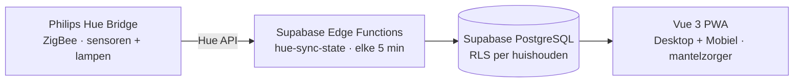

# GerustThuis Documentatie

Centrale documentatie voor het GerustThuis ecosysteem. **Broncode staat in aparte repo's — alle documentatie staat hier.**

---

## Waar te beginnen

| Je bent... | Begin hier |
|------------|------------|
| Nieuwe developer | [system-overview](docs/architecture/system-overview.md) → [database design](docs/database/design.md) → component-specifieke docs |
| Frontend developer (portaal/PWA) | [portaal architectuur](docs/architecture/portaal.md) → [app design](docs/design/app-design.md) → [content spec](docs/design/content-spec.md) |
| Backend / database | [database design](docs/database/design.md) → [hue integratie](docs/architecture/hue-integration.md) → [anomaly detection](docs/architecture/anomaly-detection.md) |
| Designer | [brandbook](docs/design/brandbook.md) → [app design](docs/design/app-design.md) |
| Product / strategie | [user stories](docs/product/user-stories.md) → [roadmap](docs/product/roadmap.md) |
| Waarom is X zo gebouwd? | [Architecture Decision Records](docs/decisions/) |

---

## Repositories

| Repository | Beschrijving | Documentatie |
|------------|--------------|--------------|
| [gerustthuis-portaal](https://github.com/dirkteur-git/gerustthuis-portaal) | Vue 3 PWA voor mantelzorgers (desktop + mobiel) | [portaal.md](docs/architecture/portaal.md) |
| [gerustthuis-app](https://github.com/dirkteur-git/gerustthuis-app) | React PWA — wordt gemerged met portaal (zie ADR-002) | [ADR-002](docs/decisions/ADR-002-vue3-pwa-merge.md) |
| [gerustthuis-supabase](https://github.com/dirkteur-git/gerustthuis-supabase) | Database migraties en Supabase Edge Functions | [design.md](docs/database/design.md) |
| [gerustthuis-website](https://github.com/dirkteur-git/gerustthuis-website) | Marketing website (Nuxt 3, SSG) | [brandbook.md](docs/design/brandbook.md) |
| [gerustthuis-admin](https://github.com/dirkteur-git/gerustthuis-admin) | Admin portaal (projectplan, beheer, rapportages) | [admin-portaal.md](docs/product/admin-portaal.md) |
| [gerustthuis-docs](https://github.com/dirkteur-git/gerustthuis-docs) | Deze repository — alle documentatie | — |

---

## Documentatie

### Architectuur & Systeem

| Document | Beschrijving |
|----------|--------------|
| [system-overview.md](docs/architecture/system-overview.md) | Systeemoverzicht: componenten, data flow, deployment |
| [local-gateway.md](docs/architecture/local-gateway.md) | Toekomstige lokale Raspberry Pi gateway architectuur |
| [hue-integration.md](docs/architecture/hue-integration.md) | Philips Hue API integratie (OAuth, polling, devices) |
| [anomaly-detection.md](docs/architecture/anomaly-detection.md) | Patroonherkenning en anomaly detection (18 features) |
| [alerts.md](docs/architecture/alerts.md) | Alert systeem: types, triggers, privacy |
| [portaal.md](docs/architecture/portaal.md) | Vue 3 portaal/PWA — views, componenten, data flow |

### Database

| Document | Beschrijving |
|----------|--------------|
| [design.md](docs/database/design.md) | Volledig database schema, tabellen, RLS policies |
| [schema.md](docs/database/schema.md) | Database schema samenvatting (quick reference) |
| [migrations-todo.md](docs/database/migrations-todo.md) | Openstaande migraties en TODO's |
| [data-plan.md](docs/database/data-plan.md) | Data-overzicht en queryplannen |

### Design & Frontend

| Document | Beschrijving |
|----------|--------------|
| [brandbook.md](docs/design/brandbook.md) | Huisstijl: kleuren, typografie, logo, tone of voice |
| [app-design.md](docs/design/app-design.md) | PWA app — schermen, design tokens, privacy-principes |
| [content-spec.md](docs/design/content-spec.md) | Content per scherm, teksten, onboarding flow |

### Product & Strategie

| Document | Beschrijving |
|----------|--------------|
| [user-stories.md](docs/product/user-stories.md) | Personages (bewoner, mantelzorger, installateur) en user stories |
| [roadmap.md](docs/product/roadmap.md) | Feature status en geplande verbeteringen |
| [admin-portaal.md](docs/product/admin-portaal.md) | Admin portaal: scope, database, fases |

### Architecture Decision Records

| Document | Beslissing |
|----------|------------|
| [ADR-001](docs/decisions/ADR-001-supabase.md) | Supabase als backend platform |
| [ADR-002](docs/decisions/ADR-002-vue3-pwa-merge.md) | Één Vue 3 PWA — merge portaal en app |
| [ADR-003](docs/decisions/ADR-003-hue-first-extensible.md) | Philips Hue als eerste integratie, architectuur uitbreidbaar |
| [ADR-004](docs/decisions/ADR-004-privacy-first.md) | Privacy-first ontwerp |

### Hardware & Legal

| Document | Beschrijving |
|----------|--------------|
| [sensors.md](docs/hardware/sensors.md) | Sensor specificaties en plaatsingsadvies |
| [privacyverklaring.md](docs/legal/privacyverklaring.md) | Privacyverklaring |
| [cookieverklaring.md](docs/legal/cookieverklaring.md) | Cookieverklaring |
| [company.md](docs/legal/company.md) | Bedrijfsgegevens BoostiX / GerustThuis |

---

## Over GerustThuis

GerustThuis is een thuismonitoringsysteem voor ouderen en hun mantelzorgers. Het systeem detecteert activiteitspatronen via sensoren en geeft mantelzorgers rust — zonder camera's of microfoons.

> Zie [system-overview.md](docs/architecture/system-overview.md) voor het volledige systeem inclusief data flow, multi-tenancy en deployment.

### Privacy-first

- Geen camera's of microfoons
- Data per huishouden geïsoleerd via Row Level Security
- App toont patronen per dagdeel — geen exacte tijdstippen
- Bewoner heeft geen account en ziet geen data

### Bedrijf

BoostiX (handelsnaam GerustThuis) — KVK 90087291
Zie [company.md](docs/legal/company.md)
