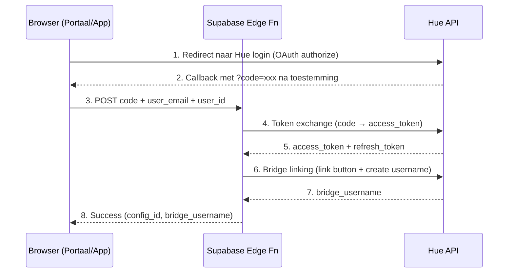
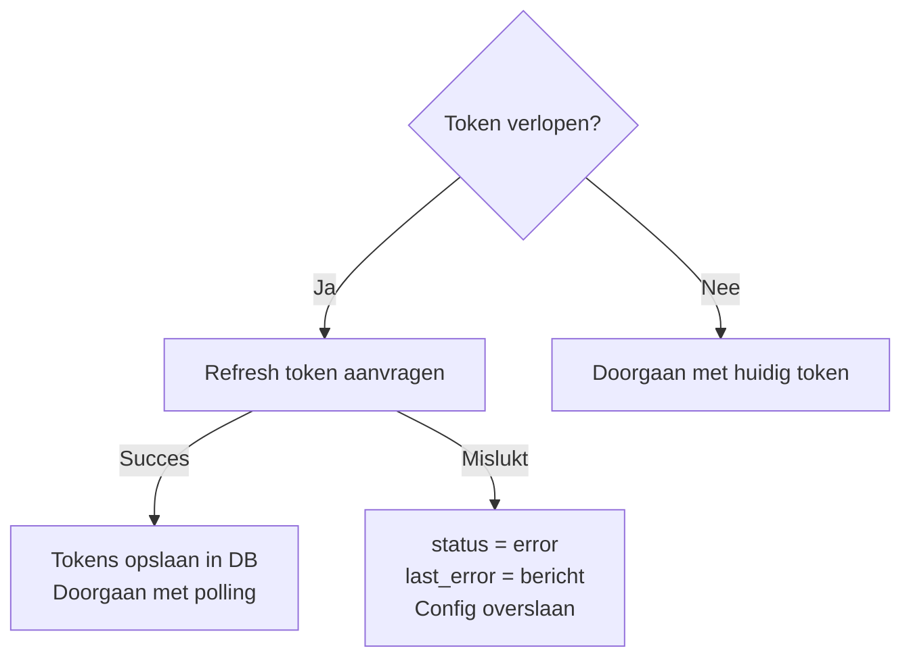

# Philips Hue Integratie

Documentatie over hoe GerustThuis communiceert met de Philips Hue Bridge.

---

## API Versies

We gebruiken **twee** Hue API versies:

| API | Versie | Gebruikt voor |
|-----|--------|---------------|
| **v1 (Classic)** | `/api/{username}/...` | Lampen, sensoren, groepen, knoppen |
| **v2 (CLIP)** | `/clip/v2/resource/...` | Contact sensoren (deuren/ramen) |

### Waarom beide?

- **v1** is de originele API, goed gedocumenteerd en stabiel
- **v2 CLIP** is nodig voor contact sensoren - deze zijn niet beschikbaar in v1
- Contact sensoren (ZigBee deur/raam sensoren) worden alleen via v2 API correct herkend

---

## Authenticatie

### OAuth 2.0 Flow



### Stap 1: Authorization URL (Frontend)

```javascript
// HueConnect.vue
const authUrl = new URL('https://api.meethue.com/v2/oauth2/authorize')
authUrl.searchParams.set('client_id', HUE_CLIENT_ID)
authUrl.searchParams.set('response_type', 'code')
authUrl.searchParams.set('state', crypto.randomUUID())  // CSRF protection

window.location.href = authUrl.toString()
```

### Stap 2: Token Exchange (Edge Function)

```typescript
// hue-token-exchange/index.ts
const response = await fetch('https://api.meethue.com/v2/oauth2/token', {
  method: 'POST',
  headers: {
    'Content-Type': 'application/x-www-form-urlencoded',
    'Authorization': `Basic ${btoa(clientId + ':' + clientSecret)}`
  },
  body: new URLSearchParams({
    grant_type: 'authorization_code',
    code: authorizationCode
  })
})

// Response:
{
  access_token: "abc123...",
  refresh_token: "xyz789...",
  expires_in: 3600,        // 1 uur
  token_type: "Bearer"
}
```

### Stap 3: Bridge Linking

Na token exchange moet de bridge gelinkt worden om een `bridge_username` te krijgen:

```typescript
// 1. Simuleer fysieke knop druk
await fetch('https://api.meethue.com/route/api/0/config', {
  method: 'PUT',
  headers: { 'Authorization': `Bearer ${accessToken}` },
  body: JSON.stringify({ linkbutton: true })
})

// 2. Vraag username aan
const response = await fetch('https://api.meethue.com/route/api', {
  method: 'POST',
  headers: { 'Authorization': `Bearer ${accessToken}` },
  body: JSON.stringify({ devicetype: 'gerustthuis#supabase' })
})

// Response: [{ success: { username: "AbC123..." } }]
```

### Token Refresh

Tokens verlopen na 1 uur. Automatische refresh met 5 minuten buffer:

```typescript
// hue-client.ts
function isTokenExpired(config: HueConfig): boolean {
  const expiresAt = new Date(config.token_expires_at).getTime()
  const buffer = 5 * 60 * 1000  // 5 minuten
  return Date.now() > (expiresAt - buffer)
}

async function refreshToken(refreshToken: string) {
  const response = await fetch('https://api.meethue.com/v2/oauth2/token', {
    method: 'POST',
    headers: {
      'Authorization': `Basic ${btoa(clientId + ':' + clientSecret)}`
    },
    body: new URLSearchParams({
      grant_type: 'refresh_token',
      refresh_token: refreshToken
    })
  })
  return response.json()
}
```

### Error Handling

**Token Refresh Failure Flow:**



**Status Transitions:**

| Van | Naar | Trigger |
|-----|------|---------|
| `active` | `error` | Token refresh mislukt |
| `active` | `expired` | Token verlopen + refresh mislukt (handmatig gezet) |
| `error` | `active` | Volgende poll cycle refresh succesvol |
| `expired` | `active` | Gebruiker doorloopt OAuth opnieuw |

**Let op:** Automatisch status herstel is nog niet volledig geïmplementeerd. De edge function update `hue_config.status` niet bij errors. Bij token refresh failure moet de gebruiker handmatig opnieuw koppelen via OAuth.

---

## Device Types

### Lampen (Lights)

**API:** v1 `GET /route/api/{username}/lights`

**State velden:**
```json
{
  "on": true,           // Aan/uit
  "bri": 254,           // Helderheid (0-254)
  "ct": 369,            // Kleurtemperatuur (Mired)
  "hue": 8418,          // Kleur hue (0-65535)
  "sat": 140,           // Kleur saturatie (0-254)
  "reachable": true     // Bereikbaar via ZigBee
}
```

**Opslag:** `hue_devices` met `device_type = 'light'`

---

### Motion Sensoren (Beweging)

**API:** v1 `GET /route/api/{username}/sensors` (type: `ZLLPresence`)

**State velden:**
```json
{
  "presence": true,           // Beweging gedetecteerd
  "lastupdated": "2024-01-15T14:30:00"
}
```

**Detectie:** We detecteren beweging door te kijken naar veranderingen in `lastupdated`, niet alleen `presence`. Dit vangt herhaalde bewegingen op wanneer `presence` al `true` is.

**Opslag:** `hue_devices` met `device_type = 'motion_sensor'`

---

### Temperatuur Sensoren

**API:** v1 `GET /route/api/{username}/sensors` (type: `ZLLTemperature`)

**State velden:**
```json
{
  "temperature": 2150,    // Temperatuur in 0.01°C (dus 21.50°C)
  "lastupdated": "2024-01-15T14:30:00"
}
```

**Opmerking:** Vaak onderdeel van dezelfde fysieke sensor als motion. Wordt gegroepeerd via `physical_devices`.

---

### Lichtsterkte Sensoren

**API:** v1 `GET /route/api/{username}/sensors` (type: `ZLLLightLevel`)

**State velden:**
```json
{
  "lightlevel": 17000,    // Lux waarde (log scale)
  "dark": false,          // Is het donker?
  "daylight": true,       // Is er daglicht?
  "lastupdated": "2024-01-15T14:30:00"
}
```

**Let op:** Temperature en light level sensoren worden aangemaakt bij device discovery, maar worden niet actief gemonitord voor state changes. Hun data wordt alleen verrijkt op het motion sensor record.

---

### Contact Sensoren (Deuren/Ramen)

**API:** v2 CLIP `GET /route/clip/v2/resource/contact`

**Waarom v2?** Contact sensoren worden niet correct herkend in v1 API.

**V2 API headers:**
```typescript
headers: {
  'Authorization': `Bearer ${accessToken}`,
  'hue-application-key': bridgeUsername  // Vereist voor v2 CLIP API
}
```

**Response structuur:**
```json
{
  "data": [{
    "id": "abc-123",
    "type": "contact",
    "owner": { "rid": "device-456" },
    "contact_report": {
      "state": "contact",      // "contact" = dicht, "no_contact" = open
      "changed": "2024-01-15T14:30:00Z"
    }
  }]
}
```

**Mapping:**
- `contact` → `open: false` (deur dicht)
- `no_contact` → `open: true` (deur open)

**Opslag:** `hue_devices` met `device_type = 'contact_sensor'`

---

### Knoppen/Schakelaars

**API:** v1 `GET /route/api/{username}/sensors` (type: `ZLLSwitch`, `ZGPSwitch`)

**State velden:**
```json
{
  "buttonevent": 1002,    // Event code
  "lastupdated": "2024-01-15T14:30:00"
}
```

**Button events:**
- `1000` - Button 1 initial press
- `1001` - Button 1 hold
- `1002` - Button 1 short release
- `1003` - Button 1 long release
- `2000`-`2003` - Button 2, etc.

**Opslag:** `hue_devices` met `device_type = 'button'`

---

## Physical Devices (Groepering)

Hue motion sensoren hebben **drie capabilities** in één fysiek apparaat:
- Motion sensor (ZLLPresence)
- Temperature sensor (ZLLTemperature)
- Light level sensor (ZLLLightLevel)

Deze worden gegroepeerd op basis van **MAC prefix** (eerste 23 karakters van `uniqueid`):

```
Motion:      00:17:88:01:0b:12:34:56-02-0406
Temperature: 00:17:88:01:0b:12:34:56-02-0402
Light:       00:17:88:01:0b:12:34:56-02-0400
             └────────────────────────┘
                    MAC prefix (gelijk)
```

**Opslag:** `physical_devices` tabel met:
- `mac_prefix`: Eerste 23 chars
- `battery_level`: Batterij percentage
- Linked via `hue_devices.physical_device_id`

---

## Room Mapping

Devices worden aan kamers gekoppeld via meerdere strategieën:

### Lampen → Kamers
Direct uit Hue Groups (type: `Room`):
```json
{
  "name": "Woonkamer",
  "type": "Room",
  "lights": ["1", "2", "3"]
}
```

### Sensoren → Kamers
1. **v2 API mapping** - Als sensor direct in room staat
2. **MAC prefix matching** - Match sensor MAC met lampen in zelfde kamer
3. **Naam matching** - Fallback op basis van sensor naam

---

## Edge Functions

### 1. `hue-token-exchange`

**Trigger:** Handmatig bij OAuth callback
**Doel:** Code → tokens → bridge linking

```
Input:  { code, user_email, user_id }
Output: { success, config_id, bridge_username }
```

### 2. `hue-sync-state`

**Trigger:** Cron elke 5 minuten (`*/5 * * * *`)
**Doel:** Poll alle devices voor state changes

```
Flow:
1. Laad alle actieve hue_config records
2. Voor elke config:
   a. Check/refresh token indien nodig
   b. Fetch lights, sensors, groups van Hue API
   c. Fetch contact sensors via v2 API
   d. Vergelijk state met last_state in database
   e. Bij verschil: insert in activity_events
   f. Update hue_devices.last_state
   g. Aggregeer naar room_activity per 5-min window via updateRoomActivity()
3. Groepeer multi-capability sensors
4. Update last_sync_at
```

### Device Discovery

De `hue-sync-state` edge function bevat automatische device discovery via `discoverDevices()`:

**Wat wordt ontdekt:**
- Lampen (lights) via v1 API
- Motion sensoren via v1 API (type: ZLLPresence)
- Contact sensoren via v2 CLIP API
- Physical devices groepering op basis van MAC prefix

**Flow:**
1. Fetch alle lights, sensors (v1) en contact resources (v2)
2. Voor elk device: check of het al bestaat in `hue_devices` (op basis van `hue_unique_id`)
3. Nieuw device → INSERT in `hue_devices` met room_name uit Hue Groups
4. Groepeer multi-capability sensoren in `physical_devices`

**Wanneer:** Discovery draait bij elke sync cycle (elke 5 minuten).

---

## Polling Schedule

| Job | Schedule | Interval | Doel |
|-----|----------|----------|------|
| hue-sync-state | `*/5 * * * *` | 5 min | Device states + discovery |

---

## Change Detection

State changes worden gedetecteerd door te vergelijken:

```typescript
const compareFields = [
  'on', 'bri', 'ct', 'hue', 'sat',  // Lampen
  'reachable',                       // Bereikbaarheid
  'presence',                        // Motion
  'open',                            // Contact
  'temperature', 'lightlevel',       // Metingen
  'dark', 'daylight',                // Licht condities
  'buttonevent'                      // Knoppen
]

function hasStateChanged(prev, curr) {
  for (const field of compareFields) {
    if (prev[field] !== curr[field]) return true
  }
  return false
}
```

**Let op:** De generieke `hasStateChanged()` functie wordt niet direct gebruikt. Elk device type implementeert eigen change detection logica in de polling code.

**Speciaal geval: Motion sensors**

> **Waarom `lastupdated` niet in compareFields staat:**
> De `hasStateChanged()` functie vergelijkt alleen de bovenstaande velden.
> Maar in de polling code wordt **apart** gechecked of `lastupdated` is veranderd:
>
> ```typescript
> const lastUpdatedChanged = previousLastUpdated !== currentLastUpdated
> if (lastUpdatedChanged || stateChanged) {
>   // Log event
> }
> ```
>
> Dit vangt herhaalde bewegingen op wanneer iemand continu beweegt (`presence` blijft `true`, maar `lastupdated` verandert steeds).

---

## Endpoints Samenvatting

| Endpoint | Methode | Doel |
|----------|---------|------|
| `https://api.meethue.com/v2/oauth2/authorize` | GET | OAuth login |
| `https://api.meethue.com/v2/oauth2/token` | POST | Token exchange/refresh |
| `https://api.meethue.com/route/api/0/config` | PUT | Bridge link button |
| `https://api.meethue.com/route/api` | POST | Create username |
| `https://api.meethue.com/route/api/{user}/lights` | GET | Alle lampen |
| `https://api.meethue.com/route/api/{user}/sensors` | GET | Alle sensoren (v1) |
| `https://api.meethue.com/route/api/{user}/groups` | GET | Alle groepen/kamers |
| `https://api.meethue.com/route/clip/v2/resource/contact` | GET | Contact sensoren (v2) |
| `https://api.meethue.com/route/clip/v2/resource/device` | GET | Device metadata (v2) |
| `https://api.meethue.com/route/clip/v2/resource/room` | GET | Kamers (v2) |

---

## Environment Variables

```bash
# Frontend (gerustthuis-portaal)
VITE_HUE_CLIENT_ID=xxx

# Backend (Supabase Edge Functions)
HUE_CLIENT_ID=xxx
HUE_CLIENT_SECRET=xxx
SUPABASE_URL=https://xxx.supabase.co
SUPABASE_SERVICE_ROLE_KEY=xxx
```
