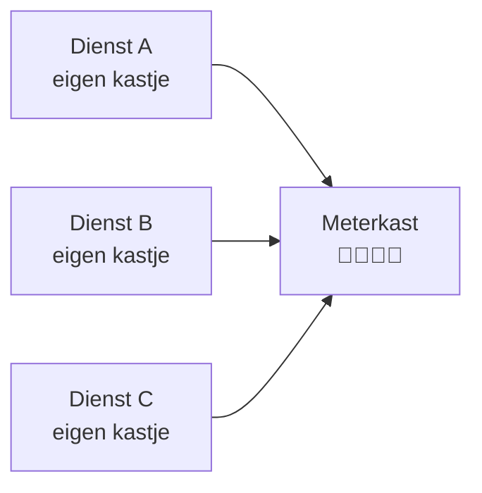
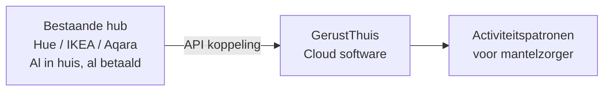

# Visie: infrastructuur zonder extra kastjes

GerustThuis bouwt geen eigen hardware en installeert geen extra kastjes. Dit document beschrijft de bredere visie op het gateway-probleem in de Nederlandse markt, en waarom we het gesprek voeren met infrastructuurpartijen.

---

## Het probleem

Elke nieuwe "slimme" zorgdienst in Nederland volgt hetzelfde patroon:

Het resultaat: een meterkast vol single-use kastjes, elk aan het stroomnet, elk met eigen firmware-updates, elk e-waste als de dienst stopt.

Andere aanbieders sturen een monteur langs, hangen hun eigen sensoren op, en rekenen €50+ per maand voor hardware die niet van de gebruiker is. Stop je ermee? Alles wordt weer opgehaald.

---

## De GerustThuis aanpak

GerustThuis werkt met **hardware die huishoudens al hebben** — Philips Hue, IKEA, Aqara en andere bestaande ecosystemen. De hub staat al in huis. GerustThuis koppelt eraan via de cloud API.

**Geen extra kastje. Geen monteur. Geen huurkosten. Jouw hardware, jouw data.**

---

## De volgende stap: infrastructuurpartners

Bestaande hubs dekken een groot deel van de markt. Maar niet elk huishouden heeft een Hue Bridge of IKEA Dirigera. De structurele oplossing ligt bij partijen die al in elk Nederlands huishouden aanwezig zijn: **internetproviders**.

KPN, Ziggo en T-Mobile leveren al een kastje bij elke aansluiting — de router. Die router heeft al een CPU, geheugen, netwerktoegang en een stabiele stroomaansluiting. De infrastructuur is er al.

> **Grote internetproviders kunnen gateway-wildgroei in de meterkast oplossen — door hun bestaande netwerken open te stellen voor diensten als GerustThuis.**

Dit betekent concreet:
- GerustThuis draait als beveiligde container of API-integratie op de router van de ISP
- Geen extra hardware nodig — de router is de gateway
- ISP wordt distributiepartner voor zorgdiensten

---

## Status

| Stap | Status |
|------|--------|
| Werken met bestaande Hue/IKEA/Aqara hubs | **Actief** |
| Uitbreiden naar meer ecosystemen | **In planning** — zie [integrations.md](integrations.md) |
| Gesprek met ISP/telecom partners | **Lopend** — strategisch traject |
| ISP-integratie | **Toekomst** — afhankelijk van partnerschap |

---

## Gerelateerd

- [ADR-003](../decisions/ADR-003-hue-first-extensible.md) — Waarom Hue first en geen eigen hardware
- [ADR-004](../decisions/ADR-004-privacy-first.md) — Privacy-model
- [integrations.md](integrations.md) — Technisch contract voor integraties
