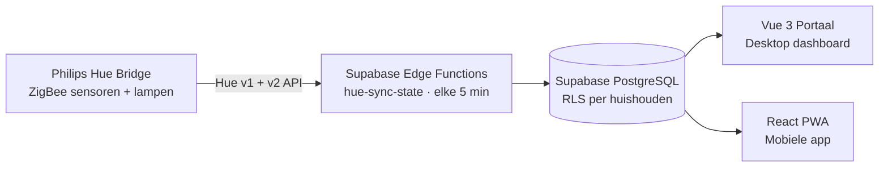
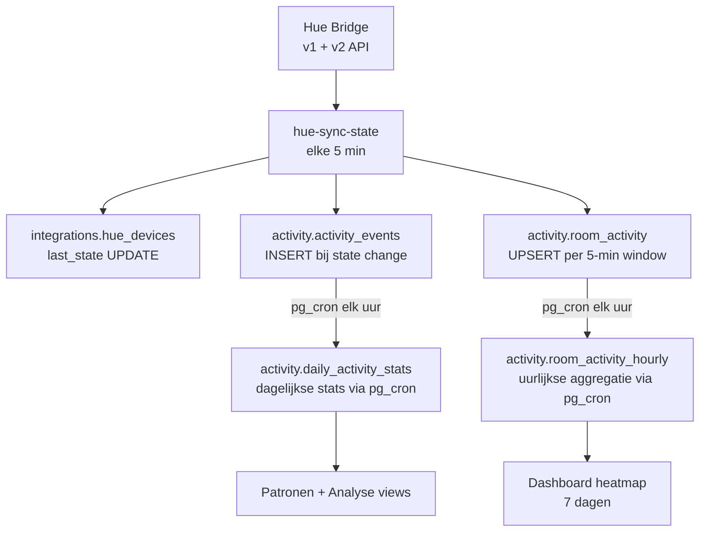
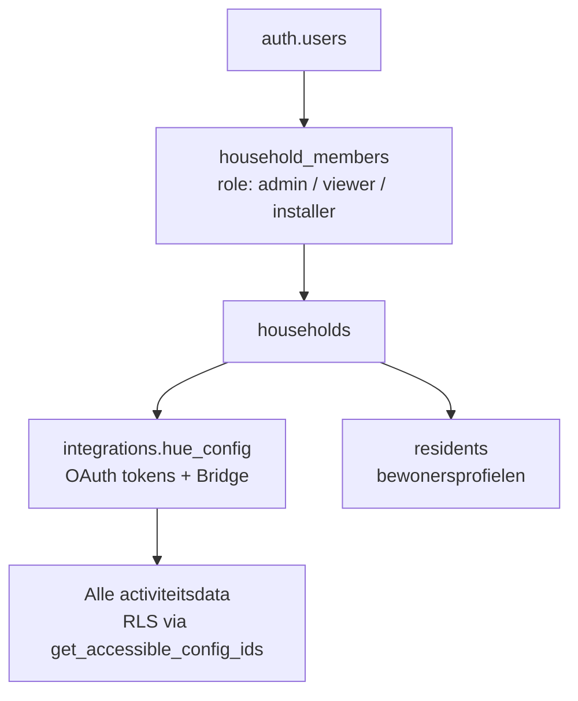

# GerustThuis Architectuur

## Overzicht

GerustThuis is een thuismonitoring systeem voor ouderen. Het systeem verzamelt sensordata via Philips Hue en detecteert activiteitspatronen.



## Componenten

### 1. Philips Hue Bridge (Sensordata)

De Hue Bridge is de enige databron. Sensoren en lampen zijn via ZigBee verbonden met de Bridge.

**Sensor types:**
- Motion sensoren (bewegingsdetectie)
- Contact sensoren (deur open/dicht)
- Lampen (aan/uit als activiteitssignaal)
- Knoppen (schakelaars, dimmers)

Zie [HUE_INTEGRATION.md](hue-integration.md) voor API details.

### 2. Supabase Edge Functions (Backend)

TypeScript Edge Functions die elke 5 minuten draaien:

| Function | Schedule | Beschrijving |
|----------|----------|--------------|
| `hue-sync-state` | `*/5 * * * *` | Synchroniseer alle device states, detecteer changes, schrijf naar activity_events en room_activity |
| `hue-token-exchange` | On-demand | OAuth token exchange bij Hue koppeling (portaal + app) |
| `waitlist-signup` | On-demand (website) | Wachtlijst aanmelding verwerken: validatie, rate limiting, DB insert, bevestigingsmail via Zoho Mail, sync naar Zoho Campaigns |
| `ga4-analytics` | On-demand (portaal) | Google Analytics 4 data ophalen via GA4 Data API — bezoekers per dag, topgepagina's, traffic bronnen (gebruikt door `/trends` view) |

**Locatie:** `gerustthuis-supabase/functions/`

**Gedeelde code:** `gerustthuis-supabase/functions/_shared/`
- `cors.ts` - CORS headers
- `hue-client.ts` - Hue API client, token refresh, state vergelijking

### 3. Supabase PostgreSQL (Database)

Alle data wordt opgeslagen in Supabase PostgreSQL met Row Level Security.

**Kerntabellen:**
- `integrations.hue_config` - OAuth tokens per gebruiker
- `integrations.hue_devices` - Alle devices met huidige state
- `integrations.physical_devices` - Gegroepeerde fysieke sensoren
- `activity.activity_events` - Ruwe sensor events (append-only)
- `activity.room_activity` - 5-minuten aggregaties per kamer
- `activity.room_activity_hourly` - Uurlijkse aggregatie per kamer (TABLE met RLS)
- `activity.daily_activity_stats` - Dagelijkse statistieken
- `public.households` - Multi-tenant huishoudens
- `public.household_members` - Gebruikersrollen per huishouden (admin/viewer/installer)
- `public.user_profiles` - Gebruikersprofielen
- `public.residents` - Bewonersprofielen (naam, relatie, foto)

Zie [DATABASE_DESIGN.md](../database/design.md) voor volledig schema.

**Personages:**

| Personage | Beschrijving | Account |
|-----------|--------------|---------|
| Bewoner | De oudere die gemonitord wordt | Geen login, profiel in `residents` |
| Mantelzorger | Hoofdverantwoordelijke — koppelt sensoren, beheert huishouden | Account, rol `admin` |
| Meekijker | Extra familielid of vriend die meekomt kijken, geen beheertaken | Account, rol `viewer` (kan upgraden naar `admin`) |
| Installateur | GerustThuis medewerker die hardware plaatst — tijdelijk toegang | Account, rol `installer` (vervalt na overdracht) |

Zie [USER_STORIES.md](../product/user-stories.md) voor user stories per personage.

### 4. Vue 3 Portaal (Frontend)

Dashboard applicatie voor mantelzorgers — desktop-first.

**Tech stack:** Vue 3, Vite, Tailwind CSS v3, Supabase JS client

**Views:**
- Dashboard - 7-dagen heatmap, status banner, recente activiteit
- Patronen - Dagritme, vandaag vs normaal, weekpatroon, trends
- Analyse - Developer view met z-score anomaly detection
- Woning - Kamers en devices overzicht
- Instellingen - Hue koppeling, huishouden beheer
- HueConnect - Hue Bridge koppeling starten (`/hue`)
- HueCallback - OAuth callback na Hue autorisatie (`/hue/callback`)
- AcceptInvitation - Uitnodiging accepteren voor huishouden
- Login - Inlogpagina

Zie [PORTAAL_ARCHITECTURE.md](portaal.md) voor frontend details.

### 5. Marketing Website

Nuxt 3 marketing website — statisch gegenereerd (SSG).

**Tech stack:** Nuxt 3, Tailwind CSS v4, Pinia, Lucide Vue Next

**Locatie:** `gerustthuis-website/`

### 6. Admin Portaal

Vue 3 admin portaal met projectplan, beheer en rapportages.

**Tech stack:** Vue 3, Vite, Tailwind CSS, Supabase

**Locatie:** `gerustthuis-admin/`

### 7. PWA App (Mantelzorgers)

Mobiele Progressive Web App voor mantelzorgers. Toont activiteitspatronen per dagdeel — geen exacte tijdstippen.

**Tech stack:** React 19, Vite, Tailwind CSS, TypeScript, Zustand, Supabase

**4 tabs:** Overzicht / Familie / Meldingen / Instellingen

**Locatie:** `gerustthuis-app/`

Zie [APP_DESIGN.md](../design/app-design.md) voor het volledige scherm- en design-overzicht.

---

## Data Flow



---

## Authenticatie

### Gebruikers
- Supabase Auth (email/password)
- Automatische household aanmaak bij signup
- Uitnodigingssysteem voor mantelzorgers

### Hue Integratie
- OAuth 2.0 flow via Philips Hue Remote API
- Token refresh automatisch bij polling
- Zie [HUE_INTEGRATION.md](hue-integration.md)

---

## Multi-tenancy

Household-based multi-tenancy — elke gebruiker ziet alleen data van zijn eigen huishouden:



**Access control:** `get_accessible_config_ids()` SQL functie (SECURITY DEFINER) bepaalt welke config IDs een user mag zien. Alle RLS policies gebruiken deze functie.

---

## Deployment

| Component | Hosting |
|-----------|---------|
| Portaal | Vercel |
| PWA App | Vercel |
| Website | Vercel |
| Database | Supabase |
| Edge Functions | Supabase |

---

## Environment Variables

### Frontend (gerustthuis-portaal)
```bash
VITE_SUPABASE_URL=https://xxx.supabase.co
VITE_SUPABASE_ANON_KEY=xxx
VITE_HUE_CLIENT_ID=xxx
```

### Backend (Supabase Edge Functions)
```bash
HUE_CLIENT_ID=xxx
HUE_CLIENT_SECRET=xxx
SUPABASE_URL=https://xxx.supabase.co
SUPABASE_SERVICE_ROLE_KEY=xxx
```
