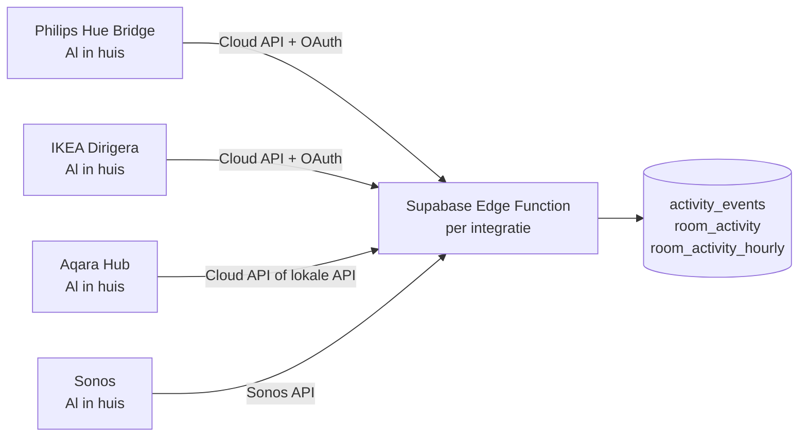

# ADR-003: Philips Hue als eerste integratie, architectuur uitbreidbaar naar bestaande ecosystemen

**Status:** Geaccepteerd
**Datum:** 2024
**Auteur:** Dirk Bakker

---

## Context

GerustThuis heeft sensordata nodig om activiteitspatronen van bewoners te detecteren. Kernprincipe: **GerustThuis bouwt geen eigen hardware en installeert geen extra kastjes**.

> "Je meterkast hangt al vol. Miljoenen Nederlandse huishoudens hebben al slimme verlichting van Philips Hue of IKEA. Die sensoren zitten al in huis — ze worden alleen nog niet slim ingezet."

Dit principe sluit een hele categorie opties direct uit:

| Optie | Waarom afgevallen |
|-------|------------------|
| Eigen hardware (sensoren + gateway) | Kastje in de meterkast — precies het probleem we aanvechten |
| Raspberry Pi + Zigbee USB | Vereist installatie van extra hardware door gebruiker |
| Eigen Zigbee gateway | Eigen kastje, eigen e-waste, geen meerwaarde |

Overgebleven opties — ecosystemen die huishoudens **al hebben**:

| Ecosysteem | Hub die al in huis is | Huishouden-penetratie NL |
|-----------|----------------------|--------------------------|
| Philips Hue | Hue Bridge | Hoog (marktleider verlichting) |
| IKEA | Dirigera / Trådfri Gateway | Groeiend (populair via IKEA winkels) |
| Aqara | Aqara Hub M2 / M3 | Groeiend (betaalbare sensoren, goede kwaliteit) |
| Sonoff (eWeLink) | NSPanel Pro / eWeLink hub | Groot, betaalbaar, populair bij doe-het-zelvers |
| Apple HomeKit | HomePod / Apple TV | Beperkt tot Apple-huishoudens |
| Samsung SmartThings | SmartThings Hub | Kleiner in NL |

---

## Beslissing

**Start met Philips Hue. Bouw de architectuur uitbreidbaar naar bestaande smart home ecosystemen. Nooit eigen hardware.**

### Waarom Hue first

1. **Adoptie:** Veel huishoudens hebben al een Hue Bridge en lampen. Nul extra hardware nodig.
2. **Remote API:** Hue biedt een cloud API (v1 + v2) met OAuth — geen installatie bij de gebruiker.
3. **Sensor types:** Motion, contact, aanwezigheid, knoppen, lichtsterkte — voldoende voor activiteitsdetectie.
4. **Bewezen:** Stabiel platform, langlopende ondersteuning door Philips/Signify.

### Prioriteitsvolgorde volgende integraties

| Prioriteit | Integratie | Reden |
|-----------|------------|-------|
| **1** | IKEA Dirigera | Grote gebruikersgroep in NL, REST API beschikbaar |
| **2** | Aqara Hub | Betaalbare sensoren, populair bij tech-bewuste gebruikers, lokale API |
| **3** | Sonoff (eWeLink) | Goedkoopste sensoren op de markt, grote doe-het-zelf community, eWeLink cloud API |
| **4** | Apple HomeKit | Relevant voor iOS-heavy doelgroep |

### Langetermijnvisie: ISP/telecom partnership

Elke integratie vereist nog steeds dat de gebruiker een bestaande smart home hub heeft. De ultieme stap is dat internetproviders (KPN, Ziggo, T-Mobile) hun infrastructuur openstellen voor diensten als GerustThuis:

> "Grote internet leveranciers kunnen gateway-wildgroei in de meterkast oplossen — door bestaande netwerken open te stellen voor diensten als GerustThuis. Dat gesprek wordt gevoerd."

Dit is een **extern traject** — GerustThuis bouwt hier niet zelf op, maar voert het gesprek actief.

---

## Architectuurprincipe

Elke integratie schrijft naar dezelfde database-tabellen. De frontend is volledig integratie-agnostisch.

**Contract voor elke integratie:** zie [integrations.md](../architecture/integrations.md)

---

## Gevolgen

**Positief:**
- Nul hardware-installatie — GerustThuis werkt met wat er al is
- Geen e-waste — geen extra kastjes die na gebruik weggegooid worden
- Geen abonnement op geleende hardware — gebruiker bezit zijn eigen sensoren
- Frontend wijzigt niet bij nieuwe integratie — data-contract is stabiel

**Negatief / risico:**
- Afhankelijk van cloud APIs van derden (Hue, IKEA, Aqara) — als zij de API sluiten, valt integratie weg
  - Mitigatie: meerdere integraties, nooit single point of failure
- API rate limits per platform — zorgvuldig polling-strategie per integratie
- Hue OAuth tokens verlopen — automatische refresh (al geïmplementeerd in `hue-client.ts`)
- Niet elk huishouden heeft een ondersteund ecosysteem — dit blijft een onboarding-drempel
